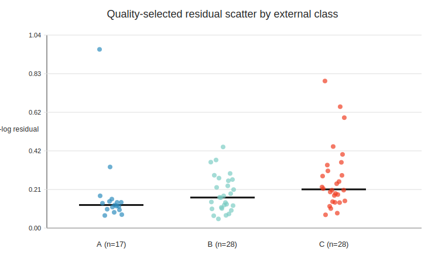
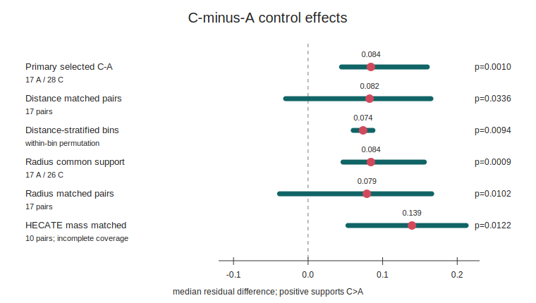
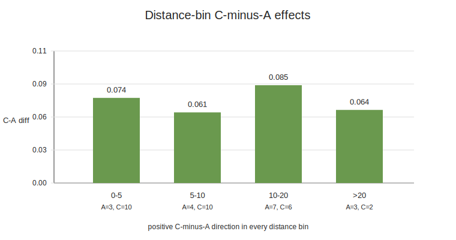

# External structural disturbance predicts low-acceleration rotation-curve residual scatter in SPARC

## Abstract

We test whether residual-blind external galaxy-coherence labels predict scatter in low-acceleration SPARC rotation-curve residual scores. The endpoint asks whether galaxies classified from external evidence as disturbed or coherence-poor show larger fixed-score residual scatter than externally regular disks. Coherence labels were assigned from source-backed external evidence without using residual outputs, then frozen before residual audit. In the quality-selected sample, the primary C-minus-A median rms-log residual difference for the fixed projection score is 0.08427, with one-sided permutation p = 0.00100 and bootstrap 95% CI [0.04481, 0.15990]. The signal remains positive in leave-one-out, radius common-support, greedy radius-matched, distance-matched, and distance-stratified controls. Effect-size checks show moderate A/C separation for the fixed projection score (AUC = 0.771) and for MOND/RAR-like low-acceleration baselines (AUC = 0.721-0.731), but not for the Newtonian baryonic baseline (AUC = 0.506). Residual distance/radius imbalance and observability systematics remain; the result is therefore a residual-disturbance phenomenology audit rather than a unique model-selection result.

## 1. Motivation

The central question is whether an external, residual-blind measure of galactic structural disturbance carries information about a fixed SPARC residual-scatter endpoint. If the residuals are sensitive to real astrophysical disturbance rather than only fitting noise or arbitrary post-hoc grouping, galaxies that are externally classified as disturbed should show larger residual scatter than externally regular disks under the fixed endpoint.

The study therefore avoids optimizing labels against residuals. The primary contrast is set before the residual audit: quality-selected C galaxies minus quality-selected A galaxies, measured by the median rms-log residual endpoint, with a one-sided greater alternative. B-labeled galaxies remain informative for trend and secondary checks, but the primary endpoint is the clean A/C separation.

The scope is deliberately limited: we test whether a frozen residual score carries residual-blind external structural information in the audited, quality-selected SPARC sample.

## 2. Related Work And Context

SPARC provides a widely used rotation-curve and mass-model data set for nearby disk galaxies, combining 3.6 micron photometry with HI/Halpha rotation curves. It has also been central to work on the radial acceleration relation, where observed centripetal acceleration correlates tightly with the baryonic acceleration inferred from the observed mass distribution. Those results motivate low-acceleration residual scores as meaningful phenomenological objects, but they do not remove the need for disturbance and systematics checks.

The present study is closest in spirit to residual auditing and data-quality phenomenology. It asks whether external structure information separates residual scatter after the score and labels are frozen. It is not a dark-matter halo fit, a full MOND test, or a derivation of a new gravitational law. It is also distinct from morphology-assisted model tuning: the labels are residual-blind and the main endpoint is fixed before the A/C contrast is computed.

Several observational issues are directly relevant. HI asymmetry and lopsidedness are common in disk galaxies and have been quantified in WHISP-family work. Dwarf-galaxy and low-mass rotation curves can also be affected by non-circular motions, pressure support, asymmetric drift, beam smearing, and line-of-sight integration. For that reason, the paper reports distance, radius, inclination, velocity-error, Hubble-type, effect-size, and controlled-regression stress checks, and it treats unresolved observability as a limitation rather than as a solved nuisance.

## 3. Fixed Residual Model

The residual prescription is treated here as a fixed model, not as a fitted galaxy-by-galaxy discovery model. The prescription was originally motivated by a broader projection-based theoretical program, but the present paper evaluates it only as a fixed, reproducible residual model. A reader does not need to accept the broader theory to evaluate the audit below.

For each SPARC radius point, the baryonic Newtonian speed scale is computed from the gas, disk, and bulge terms using fixed mass-to-light factors:

$$
V_bar^2(R) = V_gas(R)|V_gas(R)| + Upsilon_d V_disk^2(R) + Upsilon_b V_bulge^2(R)
$$

with fixed disk and bulge mass-to-light factors 0.5 and 0.7. The corresponding Newtonian acceleration scale is:

$$
a_N(R) = V_bar^2(R) / R
$$

after converting from (km/s)^2/kpc to SI units. The fixed projection multiplier used in this audit is:

$$
F_proj(R) = 1 + S_tau alpha ln(1 + a0 / a_N(R))
$$

The numerical constants are fixed before the audit: α is 0.360, the acceleration scale is 1.2e-10 m/s^2, and the coherence factor is fixed at its full value of one. The predicted speed is then:

$$
V_model(R) = F_proj(R) V_bar(R)
$$

The pointwise log residual and galaxy-level endpoint are:

$$
epsilon_i = ln(V_obs,i / V_model,i)
$$

$$
rms_log = [(1/N) sum_i epsilon_i^2]^(1/2)
$$

This formula is a fixed working prescription set in the project code before the residual-blind label audit. The study therefore frames the prescription as a reproducible residual score, not as a fully derived physical theory. The reproducibility bundle preserves the implementation used to generate the residual summaries and audit outputs.

### Model Motivation

The model starts from the standard SPARC baryonic decomposition rather than from the observed residuals. The gas, disk, and bulge terms define the Newtonian baryonic baseline shown above, and the only additional model ingredient is a fixed multiplicative correction that depends on the local baryonic acceleration scale.

The logarithmic factor is chosen as a conservative low-acceleration correction. In the high-acceleration regime, where the Newtonian acceleration is much larger than the reference scale, the logarithmic correction tends toward zero and the model approaches the baryonic baseline. In the low-acceleration regime, where the Newtonian acceleration is much smaller than the reference scale, the correction grows only logarithmically, avoiding the much faster divergence of a simple power-law boost.

The acceleration scale is fixed at the familiar low-acceleration value used in galaxy-dynamics phenomenology, and α = 0.360 is treated here as a fixed model constant. Neither the acceleration scale nor α is fitted in the residual-blind label audit. The coherence factor is set to its full fixed value for the present endpoint, so the study does not tune a galaxy-specific coherence parameter to improve individual fits.

This makes the test intentionally narrow. The coefficient α = 0.360 and the logarithmic form are treated operationally as part of the pre-frozen score; their theoretical motivation is isolated in a companion model note. The question here is whether this frozen residual score contains external, residual-blind information about galaxy structural disturbance.

The test is conditional: if the residual endpoint is sensitive to structural disturbance, then externally disturbed or coherence-poor galaxies should tend to have larger residual scatter than externally regular disks. A null result would have weakened this interpretation.

The analysis has four fixed steps:

1. Compute SPARC residual summaries under the fixed projection-based prescription.
2. Assign external coherence labels without inspecting those residual summaries.
3. Freeze the quality selection, labels, endpoint, and primary contrast.
4. Test whether quality-selected C galaxies have higher rms-log residual scatter than quality-selected A galaxies.

## 4. Data And Endpoint

The residual source is the SPARC residual summary for the fixed projection-based run. The fixed endpoint is rms-log residual scatter, evaluated after the study quality gate. Inclusion in the analysis sample requires sufficient rotation-curve support and diagnostic quality under the existing study thresholds. The quality-selected sample contains 73 galaxies: 17 A, 28 B, and 28 C.

The primary statistic is the median difference:

$$
Delta_AC = median(rms_log | C, selected) - median(rms_log | A, selected)
$$

Inference uses count-preserving label permutation for the one-sided p-value and bootstrap resampling for the median-difference confidence interval. This keeps the test aligned with the frozen A/C class sizes and avoids model-fitting degrees of freedom in the result.

## 5. Labeling Protocol And External Evidence

Labels encode external structural state rather than residual behavior. Class A denotes externally regular/coherent disks, class C denotes externally disturbed or coherence-poor systems, and class B denotes uncertain or intermediate cases. The A/C evidence rows were expanded and sharpened to reduce dependence on uncertain labels and to make the distance imbalance explicitly testable.

The labeling discipline is essential to the claim. The result is not that an analyst can separate high- and low-residual galaxies after inspecting the residuals. The claim is that residual-blind external evidence predicts the residual endpoint under a frozen audit. The paper packet now carries this as a separate audit layer: `labeling_protocol.md` defines the source rules, reviewer blinding, and A/B/C decision logic, while `external_evidence_table.csv` gives the row-level evidence summary, evidence type, source links, reviewer/date fields, and residual-blind flag for every quality-pass galaxy.

The protocol is intentionally conservative. A requires direct regular-disk evidence such as regular HI/Halpha kinematics, low asymmetry, or a well-defined symmetric rotation curve. C requires direct disturbance evidence such as disturbed HI morphology, lopsided velocity fields, tidal or interaction signatures, or warp evidence tied to gas morphology or kinematics. Environment-only, bar-only, or rotation-curve-quality-only information is not enough for an A/C call; ambiguous rows default to B.

Figure 1 shows the quality-selected residual distribution by external class. The result is not driven by a hidden residual-derived relabeling step: class labels are external, while the plotted residuals enter only after the labels are frozen.



## 6. Primary Result

The primary result is positive. In the quality-selected A/C sample:

| comparison | n A | n C | median A | median C | C-A diff | p | CI low | CI high |
| --- | --- | --- | --- | --- | --- | --- | --- | --- |
| quality-selected C-minus-A | 17 | 28 | 0.12436 | 0.20862 | 0.08427 | 0.00100 | 0.04481 | 0.15990 |

The direction is the predicted one: externally disturbed/coherence-poor galaxies have larger fixed-score residual scatter than externally regular galaxies. The bootstrap interval is fully positive and the one-sided permutation p-value is 0.00100.

The effect is not only a p-value result. A descriptive effect-size appendix gives a common-language AUC of 0.771 for the fixed projection score, meaning that a randomly selected C galaxy has larger fixed-score rms-log scatter than a randomly selected A galaxy in about 77% of A/C pairs. The robust median-scaled effect is 0.938. These are moderate-to-large descriptive separations for an observational audit, not precision estimates of a universal physical effect size.

Secondary quality-selected checks support the same ordering. The C-minus-nonC contrast is positive (p = 0.0173), and the ordered A-to-B-to-C trend is positive (rho = 0.3620, p = 0.00110). The A/C leave-one-out check produces no sign flips.

Figure 2 summarizes the primary result and the main controls on a common effect scale. This is the main visual check that the signal is not confined to the unadjusted primary contrast.



## 7. Distance And Scale Controls

The main potential confound is that C galaxies are, on average, closer and smaller in radius than A galaxies. Label refinement and control analyses reduce this concern but do not remove it. Raw SPARC distance imbalance remains visible: the A median distance is 13.8 Mpc, the C median distance is 7.83 Mpc, the C-minus-A gap is -5.97 Mpc, and the two-sided imbalance p-value is 0.02490.

The important change is that matched and stratified controls no longer collapse the signal:

| control | effect | p |
| --- | --- | --- |
| greedy SPARC distance-matched pairs | 0.08247 | 0.03360 |
| optimal ordered SPARC distance-matched pairs | 0.08247 | 0.03610 |
| strict <=2 Mpc distance caliper | 0.11949 | 0.08979 |
| distance-stratified within-bin test | 0.07374 | 0.00940 |

Every distance bin has a positive C-minus-A median difference:

| SPARC distance bin | n A | n C | C-A diff |
| --- | --- | --- | --- |
| 0-5 Mpc | 3 | 10 | 0.07409 |
| 5-10 Mpc | 4 | 10 | 0.06147 |
| 10-20 Mpc | 7 | 6 | 0.08512 |
| >20 Mpc | 3 | 2 | 0.06361 |

Figure 3 shows the same within-bin result visually. The raw distance distributions are still not identical, but the C-minus-A direction is positive inside every SPARC distance bin.



Radius controls also preserve the predicted direction. The max-radius imbalance remains statistically visible (p = 0.00190), but the radius common-support test is positive (p = 0.00090), greedy radius-matched pairs are positive (p = 0.01020), and the strict <=2 kpc radius caliper remains positive but underpowered (p = 0.10969).

HECATE stellar-mass matching is directionally supportive where coverage exists: greedy mass-matched pairs give p = 0.01220 and optimal ordered mass-matched pairs give p = 0.01440. Because HECATE coverage is incomplete in the SPARC dwarf regime, this is a supplementary control rather than primary evidence.

The selection/observability appendix makes the same issue explicit. It records distance, distance uncertainty, radial coverage, point count, velocity-error, inclination, inclination-error, Hubble-type, WHISP-family coverage, and partial HECATE mass balance. A robust regression stress test is positive in the class-only and distance-only specifications, weakens after distance and radial coverage are included together, and remains positive but not bootstrap-exclusive of zero in the full observability specification. This is a useful constraint on the claim: the signal is directionally stable across several controls, but it is not yet an observability-proof physical detection.

The threshold-sensitivity and weighted-residual distribution figures remain useful diagnostics, but they are better treated as supplementary material because they repeat the same class-ordering message rather than testing the main potential confound.

## 8. Alternative Baseline Scores

The same residual-blind A/C labels were also compared against three alternative baseline scores computed from the same SPARC rotmod rows and the same fixed mass-to-light factors. These are not replacement primary endpoints; they test whether the class separation is specific to the frozen projection score or reflects a broader sensitivity of smooth rotation-curve residual scores to external disturbance.

| score | n A | n C | median A | median C | C-A diff | p | CI low | CI high |
| --- | --- | --- | --- | --- | --- | --- | --- | --- |
| fixed projection score | 17 | 28 | 0.12436 | 0.20862 | 0.08427 | 0.00210 | 0.04440 | 0.15792 |
| Newtonian baryonic | 17 | 28 | 0.57056 | 0.61615 | 0.04559 | 0.39546 | -0.20123 | 0.31376 |
| MOND simple-mu | 17 | 28 | 0.11366 | 0.23238 | 0.11872 | 0.00190 | 0.00305 | 0.17644 |
| empirical RAR | 17 | 28 | 0.11360 | 0.22442 | 0.11082 | 0.00210 | 0.00583 | 0.17395 |

The Newtonian baryonic baseline is not a significant separator in this sample. The MOND-like and empirical RAR baselines show a positive A/C separation, so the present result should not be described as uniqueness evidence for the projection formula. It is stronger and cleaner to state that external structural disturbance predicts larger scatter in a pre-frozen projection residual score, while related low-acceleration residual scores show compatible disturbance sensitivity.

The effect-size comparison makes this point more physical. The fixed projection score has AUC = 0.771, MOND simple-mu has AUC = 0.721, empirical RAR has AUC = 0.731, and the Newtonian baryonic baseline has AUC = 0.506. Thus the A/C separation is not a generic property of every residual score; it appears mainly in low-acceleration residual scores.

## 9. Interpretation

The result shows that an externally assigned, residual-blind structural label separates the fixed residual endpoint in the predicted direction. The signal is not confined to the broad full sample, does not depend on B labels, survives leave-one-out checks, and remains positive under distance/radius/mass controls.

The conservative interpretation is that the result identifies a reproducible residual-disturbance association in this audited SPARC sample. In the residual-blind, quality-selected audit, externally disturbed galaxies show larger fixed-score residual scatter than externally regular disks, and the direction persists under the current distance-matched and distance-stratified controls.

The physical interpretation is not that the projection score is uniquely selected. Larger scatter in the C class may instead mark the presence of non-equilibrium structure, non-circular motions, lopsided gas kinematics, warps, or interaction-driven asymmetries. Such systems are intrinsically harder for any smooth axisymmetric rotation-curve prescription to describe, regardless of whether that prescription is Newtonian, MOND/RAR-like, or projection-based. In this sense, the C>A residual scatter is best read as a disturbance-sensitive residual phenomenology, not as a model-specific proof.

## 10. Limitations

Residual distance and radius imbalance remains the main methodological limitation. The controls mitigate this risk, but raw A/C distance and radius distributions are still not exchangeable. This is physically important: closer galaxies may reveal morphological disturbances and rotation-curve substructure more readily than more distant galaxies. Strict caliper tests are positive but have limited support, especially at small calipers. HECATE mass controls are useful but incomplete, so they cannot serve as primary evidence on their own.

The current packet also lacks homogeneous beam-size or physical HI-resolution measurements. Distance, radius, point count, and velocity-error controls are therefore proxies for observability rather than a direct beam-smearing correction. The controlled-regression appendix should be read in that spirit: it supports the direction of the effect in simpler robust specifications, but it also shows that the class coefficient is sensitive to joint observability controls.

Inclination and kinematic systematics are also not fully exhausted. The quality gate removes the most extreme inclination failures, but edge-on line-of-sight integration, low-inclination deprojection uncertainty, asymmetric drift, beam smearing, pressure support, and non-circular motions can still affect galaxy-level scatter. The inclination/systematics appendix shows that C remains larger than A in the populated 45-60, 60-75, and 75-85 degree inclination bins, but this is a descriptive check with small bin counts, not a replacement for homogeneous velocity-field quality metadata.

The result should therefore be read as a residual-disturbance audit, not as a unique model-selection result. A central physical caveat is that the C class likely contains more non-equilibrium or non-circular systems, for which any smooth axisymmetric rotation-curve score would be expected to perform worse. This is not a nuisance detail; it is one plausible astrophysical origin of the observed excess scatter.

The baseline comparisons sharpen the interpretation. Newtonian baryonic residuals do not reproduce the sharp A/C separation, while MOND-like and empirical RAR residual scores show compatible positive separation. The strongest contribution is therefore the residual-blind, pre-frozen association between external disturbance labels and low-acceleration residual scatter, with baseline comparisons reported transparently.

The study is also a single-dataset audit. Independent validation is the main remaining data requirement.

## 11. Known Limitations And Phase II Validation Plan

The remaining weaknesses are now mainly data-side limitations rather than conceptual blockers. First, the quality-selected primary A/C sample is still modest (`n_A = 17`, `n_C = 28`). Second, observability degeneracy is not fully removed: closer or better-resolved galaxies may reveal disturbance more readily, and the current packet lacks homogeneous beam-size or physical HI-resolution metadata. Third, the result is still internal to the SPARC audit sample.

These limitations define the Phase II validation path. A follow-up should freeze the same residual endpoint, labeling rule, and effect-size summaries before applying them to independent resolved-HI samples. The most useful targets are WHISP, LITTLE THINGS, THINGS, and LVHIS, because they can provide better leverage on HI asymmetry, non-circular motions, beam/resolution metadata, and dwarf-galaxy systematics. The goal of Phase II is not to tune the present score, but to ask whether residual-disturbance separation reproduces under independent observability conditions.

If the A/C or continuous-disturbance separation reproduces in one or more of these samples after the endpoint and labeling rule are frozen, the result would move from a SPARC audit signal to a broader galaxy-dynamics phenomenology. If it does not reproduce, the present result should be treated as SPARC-sample-specific or observability-driven.

## 12. Figures And Tables

The minimum main-text figure set is:

| figure | file | role |
| --- | --- | --- |
| Figure 1 | `figures/quality_pass_rms_distribution.svg` | quality-selected class-separated primary endpoint |
| Figure 2 | `figures/control_forest_plot.svg` | primary and control effects on one scale |
| Figure 3 | `figures/distance_stratified_effects.svg` | distance-bin directionality check |

The weighted-residual distribution, threshold-sensitivity heatmap, process diagram, and single-effect summary graphic remain useful supplementary diagnostics, but they do not carry the main visual argument.

The minimum table set is:

| table | file | role |
| --- | --- | --- |
| Table 1 | `final_tables.md` | class medians, primary endpoint, comparisons, trend |
| Table 2 | `distance_stratified_control.md` | within-distance-bin A/C control |
| Table 3 | `scale_matched_stress.md` | distance and mass matched-pair checks |
| Table 4 | `radius_control_stress.md` | radius common-support and radius-matched checks |
| Table 5 | `scale_mass_distance_control.md` | raw covariate imbalance checks |
| Table 6 | `external_evidence_table.csv` | row-level residual-blind label evidence |
| Table 7 | `baseline_score_comparisons.md` | alternative residual-score baseline comparisons |
| Table 8 | `selection_observability_appendix.md` | selection-function and observability proxy summary |
| Table 9 | `controlled_regression_appendix.md` | robust nested regression stress check |
| Table 10 | `effect_size_appendix.md` | effect-size and AUC sanity checks |
| Table 11 | `inclination_systematics_appendix.md` | inclination and remaining kinematic systematics |

For a short submission, the main-text table focus should be the primary endpoint, the baseline/effect-size comparison, and the compact control summary. The full row-level evidence table, regression table, and systematics counts can remain supplementary.

## 13. Reproducibility Bundle

The full reproducibility package, including the frozen labels, external evidence table, baseline-score comparisons, control summaries, figures, and regeneration scripts, is archived at [DOI]. The analysis can be regenerated with the commands listed in Section 13.

The reproducibility bundle contains the generated tables, control summaries, matched-pair rows, figures, manifest, and status notes under:

```text
studies/sparc_residual_coherence_test_v01/paper_packet_v06_distance_balanced
```

The key manuscript and audit files are:

```text
final_tables.md
final_comparisons.csv
distance_stratified_control.md
scale_matched_stress.md
radius_control_stress.md
scale_mass_distance_control.md
labeling_protocol.md
external_evidence_table.csv
baseline_score_comparisons.md
baseline_score_by_galaxy.csv
selection_observability_appendix.md
controlled_regression_appendix.md
effect_size_appendix.md
inclination_systematics_appendix.md
manuscript_draft.md
manuscript_skeleton.md
paper_status.md
```

The regeneration commands are:

```text
python studies/sparc_residual_coherence_test_v01/download_sparc_data.py
python studies/sparc_residual_coherence_test_v01/make_labeling_protocol_and_baselines.py
python studies/sparc_residual_coherence_test_v01/make_selection_and_regression_appendix.py
python studies/sparc_residual_coherence_test_v01/make_effect_size_and_systematics_appendix.py
python studies/sparc_residual_coherence_test_v01/make_manuscript_pdf.py
PYTHONPATH=src python -m pytest -q
```

The raw SPARC rotmod files are not redistributed in this repository. The included download script fetches the public SPARC Zenodo archive and places the rotmod files under `data/sparc/Rotmod_LTG` and the compact metadata table under `data/external/SPARC_Table1.txt`, the paths expected by the regeneration scripts.

## 14. References

- Lelli, F., McGaugh, S. S., & Schombert, J. M. 2016, AJ, 152, 157, "SPARC: Mass Models for 175 Disk Galaxies with Spitzer Photometry and Accurate Rotation Curves", doi:10.3847/0004-6256/152/6/157.
- McGaugh, S. S., Lelli, F., & Schombert, J. M. 2016, PRL, 117, 201101, "The Radial Acceleration Relation in Rotationally Supported Galaxies", doi:10.1103/PhysRevLett.117.201101.
- Lelli, F., McGaugh, S. S., Schombert, J. M., & Pawlowski, M. S. 2017, ApJ, 836, 152, "One Law to Rule Them All: The Radial Acceleration Relation of Galaxies", doi:10.3847/1538-4357/836/2/152.
- van Eymeren, J., Jutte, E., Jog, C. J., Stein, Y., & Dettmar, R.-J. 2011, A&A, 530, A30, "Lopsidedness in WHISP galaxies. II. Morphological lopsidedness", doi:10.1051/0004-6361/201016178.
- Oman, K. A., et al. 2019, MNRAS, 482, 821, "Non-circular motions and the diversity of dwarf galaxy rotation curves".
- Oh, S.-H., Hunter, D. A., Brinks, E., et al. 2015, AJ, 149, 180, "High-resolution Mass Models of Dwarf Galaxies from LITTLE THINGS", doi:10.1088/0004-6256/149/6/180.

## 15. Conclusion

The distance- and scale-controlled analysis finds a positive, statistically sharp association between external structural-disturbance labels and fixed-score residual scatter. Under the residual-blind primary endpoint, externally disturbed or coherence-poor galaxies show larger scatter than externally regular disks, and the direction persists under matched and stratified controls.

The result therefore indicates a reproducible residual-disturbance association in the audited SPARC sample. A physically natural interpretation is that C-class systems contain more non-equilibrium or non-circular motion, which would increase scatter for any smooth axisymmetric model. Because distance/radius imbalance remains and MOND/RAR-like baselines show compatible disturbance sensitivity, the analysis should not be read as a standalone proof of the projection model. The supported statement is narrower: the frozen residual score carries external, residual-blind structural information in this sample, and the main controls do not explain the signal away.
